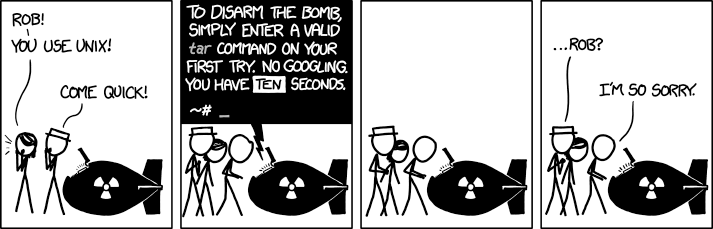

## FortiAIGate Installation
In the previous sections we worked on getting an environment to run Kubernetes (K8s), installing K8s, and setting up additional containers and pods to build out the resources we will protect in this demo environment. The next step will be to install FortiAIGate itself using the supplied helm charts that come with the FortiAIGate release files. 

## Background Information
FortiAIGate is distributed via a collection of container files in tar (Tape ARchive) format that must be loaded into a container repository so that they are available for download by K8s when deployed. _We have already completed this step for you_, but a customer might need to setup their own repo server (for example the [Harbor](https://goharbor.io/) repository server) and upload the images there. The FortiAIGate `values.yaml` file would need to be updated to reflect that new repo server location.

## FortiAIGate Helm Charts
One of the files included with the FortiAIGate containers is a file that contains the helm chart files that we need to use to deploy FortiAIGate to K8s. We will download this file from blob storage in Azure, extract its contents, ensure we have a valid license file available, and then execute the process to install FortiAIGate using helm.

1. Start by logging into [Azure Portal](https://portal.azure.com/).

1. Open the Azure Cloud Console.

    

1. Run the following command to download the helm chart tar file:

    ```
    cd $HOME
    wget "https://faighelm.blob.core.windows.net/faighelm/FAIG_helm_chart-V8.0.1-build0031-FORTINET.tar"
    wget "https://faighelm.blob.core.windows.net/faighelm/values.yaml"
    ```

    If this downloads correctly you should see the file listed in your home directory.

    ```
    ls -lash FAIG_helm_chart-V8.0.1-build0031-FORTINET.tar values.yaml
    ```

1. Next, let's extract the files from the tar file:

    ```
    cd $HOME
    tar xvf FAIG_helm_chart-V8.0.1-build0031-FORTINET.tar
    ```

    

1. We will copy over your license file so that it is in the correct folder:

    ```
    cd $HOME
    cp license.lic fortiaigate/files/licenses/
    ```

1. Let's create a K8s namespace that will contain FortiAIGate. Run the following:

    ```
    kubectl create namespace fortiaigate
    ```

    You should see:

    ```
    namespace/fortiaigate created
    ```

1. Now that we have everything configured and ready to go, we can finally install FortiAIGate. Run the following command:

    ```
    cd $HOME
    helm install fortiaigate ./fortiaigate -n fortiaigate -f values.yaml
    ```

    The output should return the following at the top:

    ```
    NAME: fortiaigate
    LAST DEPLOYED: Fri Jul 24 19:24:56 2026
    NAMESPACE: fortiaigate
    STATUS: deployed
    REVISION: 1
    DESCRIPTION: Install complete
    TEST SUITE: None
    NOTES:
    🎉 FortiAIGate has been successfully deployed!
    ...
    ```

1. The containers will take a little bit to get deployed. We can watch the status of the deployment using the following command:

    ```
    watch kubectl get pods -n fortiaigate
    ```

    {}It might take a few minutes for the cluster to come online fully. Seeing pods crash or loop during startup is not unexpected. There are dependencies between the pods, but some pods might not start cleanly and take a few attempts before they start correctly. Just be patient and watch for your pod status to match that of the screenshot below.{}

    You are looking for the pods to end up looking something like this:

    

    All pods are showing "Running" with "1/1" Ready. These indicate that each service has started correctly and is running without any issues.

1. If you have any pods running with a different status then you might need to investigate what went wrong.

    ```
    kubectl describe pod -n fortiaigate <name of pod>
    ```

    Change out the &lt;name of pod&gt; to match the name of the pod (api, core, webui, etc).

1. Once you have FortiAIGate up and running run the following command in Cloud Console and then click on the link it generates:

    ```
    echo https://$(whoami)-worker.eastus.cloudapp.azure.com
    ```

1. You will be taken to the demo landing page. Click on FortiAIGate in the top menu:

    

1. Then click on "Open FortiAIGate WebUI":

    

1. You should see the main login page for the FortiAIGate:

    

## Good to Go?
If you can access the FortiAIGate WebUI and see the login screen, you are good to go! Proceed to the next section to start the demo.

{}
Continue to the [FortiAIGate Configuration]().
{}